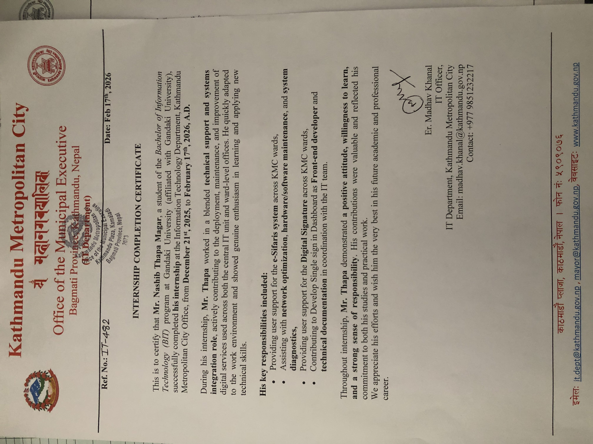

<html lang="en">
<head>
  <meta charset="UTF-8">
  <meta name="viewport" content="width=device-width, initial-scale=1.0">
  <meta name="google-site-verification" content="TCYDjPGs4mjTQmvE4JIqweCYrrjbfu549UuGoTykXSg" />
  <meta name="title" content="Nashib Thapa Magar - Portfolio | Web Developer | Software Engineer ">
  <meta name="description" content="Explore the portfolio of Nashib Thapa Magar, an innovative, skilled web developer and software engineer specializing in innovative web applications, software solutions, and user-friendly designs. Let's build something great together!">
  <title>Nashib Thapa Magar Portfolio</title>
  
  <link href="https://cdn.jsdelivr.net/npm/bootstrap@5.3.0/dist/css/bootstrap.min.css" rel="stylesheet">
  
  
</head>
<body class="bg-dark text-light">

  <header class="py-3">
    <nav class="container d-flex align-items-center justify-content-between">
      Nashib Thapa Magar
      NTM
      

        <a href="#projects" class="mx-4">Projects</a>
        <a href="#certificates" class="mx-4">Certificates</a>
        <a href="#internship" class="mx-4">Internship</a>
        <a href="#contact" class="mx-4">Contact</a>
      

    </nav>
  </header>

  <section class="hero-section py-5 text-center">
    <video autoplay muted loop id="myVideo">
      <source src="https://videos.pexels.com/video-files/3129671/3129671-uhd_2560_1440_30fps.mp4" type="video/mp4">
    </video>
    

      <h1 class="fs-1 fw-bold mb-4">Welcome To My Portfolio</h1>
      
Enthusiastic Full stack developer skilled in JavaScript, Java, PHP, MySQL and modern frameworks.

    

  </section>

  <section id="projects" class="container py-5">
    <h2 class="fs-1 fw-bold mb-4">Featured Projects</h2>
    
    

      

        <h3 class="text-success mb-3">Weather APP</h3>
        
A Dedicated site for Weather Forecasting.

        

          HTML 5
          CSS 3
          Tailwind CSS
          JavaScript
          React.js
        

        <a target="_blank" href="https://github.com/Nashib09/Weather-App-using-React.js.git" class="btn btn-success">View Project</a>
      

    

    

      

        <h3 class="text-success mb-3">Contact Management System</h3>
        
A centralized website for contact management system.

        

          MongoDB
          Express JS
          React.js
          Node.js
        

        <a target="_blank" href="https://github.com/Nashib09/MERN-STACK-Contact-Management-System.git" class="btn btn-success">View Project</a>
      

    

     

      

        <h3 class="text-success mb-3">Student Management System</h3>
        
A centralized website for Student Portal.

        

          Mongo DB
          Next.JS
          Tailwind CSS
        

        <a target="_blank" href="https://github.com/Nashib09/s-management-system-.git" class="btn btn-success">View Project</a>
      

    

  </section>

  <section id="certificates" class="container py-5">
    <h2 class="fs-1 fw-bold mb-4">Courses and Certificates</h2>
    

      
      

        

          

            <h3 class="h5 mb-2 text-success">Node.js MERN STACK</h3>
            
Aug 2025

          

          <button class="cert-btn mt-3 align-self-start" data-bs-toggle="modal" data-bs-target="#certMernModal">View Certificate</button>
        

      

      

        

          

            <h3 class="h5 mb-2 text-success">AI Powered FullStack</h3>
            
Jan 2026

          

          <button class="cert-btn mt-3 align-self-start" data-bs-toggle="modal" data-bs-target="#certAiModal">View Certificate</button>
        

      

      

        

          

            <h3 class="h5 mb-2 text-success">Microsoft Office- Beginner</h3>
            
2012

          

          
Image Attachment Verified

        

      

    

  </section>

  <section id="internship" class="container py-5">
    

      <h2 class="fs-1 fw-bold m-0 text-light">Internship</h2>
      <button class="cert-btn" data-bs-toggle="modal" data-bs-target="#certInternshipModal">View Certificate</button>
    

    

      Virtual internship on System integration role and technical support [December 2025 - February 2026]
    

  </section>

  <section id="contact" class="container py-5">
    <h2 class="fs-2 fw-bold mb-4">Contact Me</h2>
    

      <a href="tel:+9779842266372" class="contact-chip">
        <svg class="me-2" fill="#ffffff" viewBox="0 0 24 24" width="20" height="20">
          <path d="M6.62 10.79c1.44 2.83 3.76 5.14 6.59 6.59l2.2-2.2c.27-.27.67-.36 1.02-.24 1.12.37 2.33.57 3.57.57.55 0 1 .45 1 1V20c0 .55-.45 1-1 1-9.39 0-17-7.61-17-17 0-.55.45-1 1-1h3.5c.55 0 1 .45 1 1 0 1.25.2 2.45.57 3.57.11.35.03.74-.25 1.02l-2.2 2.2z" />
        </svg>
        Call
      </a>
    

    

      

        <h3 class="fs-4 mb-3">Feedback</h3>
        <form>
          

            <label for="name" class="form-label">Name</label>
            <input type="text" id="name" class="form-control bg-dark text-light border-secondary" required>
          

          

            <label for="message" class="form-label">Message</label>
            <textarea id="message" class="form-control bg-dark text-light border-secondary" rows="4" required></textarea>
          

          <button type="submit" class="btn btn-success px-4">Send Message</button>
        </form>
      

    

  </section>

  

    <a href="https://github.com/Nashib09" target="_blank" rel="noopener noreferrer" class="social-link">
      <svg fill="#ffffff" viewBox="0 0 24 24" width="22" height="22"><path d="M12 0c-6.626 0-12 5.373-12 12 0 5.302 3.438 9.8 8.207 11.387.599.111.793-.261.793-.577v-2.234c-3.338.726-4.033-1.416-4.033-1.416-.546-1.387-1.333-1.756-1.333-1.756-1.089-.745.083-.729.083-.729 1.205.084 1.839 1.237 1.839 1.237 1.07 1.834 2.807 1.304 3.492.997.107-.775.418-1.305.762-1.604-2.665-.305-5.467-1.334-5.467-5.931 0-1.311.469-2.381 1.236-3.221-.124-.303-.535-1.524.117-3.176 0 0 1.008-.322 3.301 1.23.957-.266 1.983-.399 3.003-.404 1.02.005 2.047.138 3.006.404 2.291-1.552 3.297-1.23 3.297-1.23.653 1.653.242 2.874.118 3.176.77.84 1.235 1.911 1.235 3.221 0 4.609-2.807 5.624-5.479 5.921.43.372.823 1.102.823 2.222v3.293c0 .319.192.694.801.576 4.765-1.589 8.199-6.086 8.199-11.386 0-6.627-5.373-12-12-12z"/></svg>
    </a>
    <a href="https://www.linkedin.com/in/nashib-thapa-magar-78b830375/" target="_blank" rel="noopener noreferrer" class="social-link">
      <svg fill="#ffffff" viewBox="0 0 24 24" width="22" height="22"><path d="M20.447 20.452h-3.554v-5.569c0-1.328-.027-3.037-1.852-3.037-1.853 0-2.136 1.445-2.136 2.939v5.667H9.351V9h3.414v1.561h.046c.477-.9 1.637-1.85 3.37-1.85 3.601 0 4.267 2.37 4.267 5.455v6.286zM5.337 7.433c-1.144 0-2.063-.926-2.063-2.065 0-1.138.92-2.063 2.063-2.063 1.14 0 2.064.925 2.064 2.063 0 1.139-.925 2.065-2.064 2.065zm1.782 13.019H3.555V9h3.564v11.452zM22.225 0H1.771C.792 0 0 .774 0 1.729v20.542C0 23.227.792 24 1.771 24h20.451C23.2 24 24 23.227 24 22.271V1.729C24 .774 23.2 0 22.222 0h.003z"/></svg>
    </a>
  

  

    

      

        

          Node.js MERN STACK Certificate
          <button type="button" class="btn-close btn-close-white" data-bs-dismiss="modal" aria-label="Close"></button>
        

        

          
        

      

    

  

  

    

      

        

          AI Powered FullStack Certificate
          <button type="button" class="btn-close btn-close-white" data-bs-dismiss="modal" aria-label="Close"></button>
        

        

          
        

      

    

  

  

    

      

        

          Internship Certificate
          <button type="button" class="btn-close btn-close-white" data-bs-dismiss="modal" aria-label="Close"></button>
        

        

          
        

      

    

  

  
</body>
</html>
